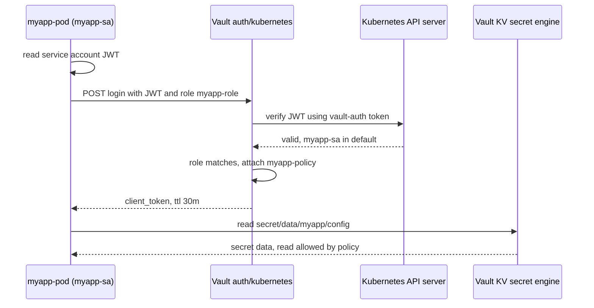

## Introduction

In the dynamic world of Kubernetes, managing sensitive information like API keys, passwords, and certificates is paramount. Storing these secrets directly within Kubernetes manifests or ConfigMaps poses significant security risks. Vault, by HashiCorp, provides a robust and secure solution for managing and protecting these secrets. This blog post explores how to effectively integrate Vault with Kubernetes to enhance the security of your applications and infrastructure. We'll delve into the core concepts, practical implementation steps, and best practices for securing secrets using Vault within a Kubernetes environment.

## Core Concepts: Vault and Kubernetes Secrets Management

Before diving into the implementation, let's clarify the fundamental concepts.

*   **Vault:** Vault is a secrets management tool that provides a centralized location for storing and accessing secrets. It offers features like secret encryption, access control policies, audit logging, and secret revocation, making it a comprehensive solution for managing sensitive data. Vault acts as a trusted broker between applications and secrets.

*   **Kubernetes Secrets:** Kubernetes Secrets are objects designed to hold sensitive information. While Kubernetes offers Secrets natively, they are stored in etcd, Kubernetes' distributed key-value store. By default, secrets in etcd are base64 encoded, *not* encrypted. Therefore, they are not inherently secure, especially in a shared cluster environment.  Vault provides a more secure alternative by storing secrets encrypted at rest and enforcing strict access control.

*   **Secret Engines:** Vault uses "secret engines" to manage different types of secrets. Common secret engines include the Key/Value (KV) secret engine for storing arbitrary data, the AWS secret engine for dynamically generating AWS credentials, and the database secret engine for dynamically generating database credentials.

*   **Authentication Methods:** Vault supports various authentication methods, including Kubernetes authentication, which allows Kubernetes pods to authenticate with Vault using their service account tokens. This is a cornerstone of secure integration between Kubernetes and Vault.

*   **Policies:** Vault policies define which secrets and operations a particular client (e.g., a Kubernetes pod) is allowed to access. Policies provide granular control over secret access, ensuring that only authorized applications can access specific secrets.

## Implementation: Integrating Vault with Kubernetes

This section walks through a practical example of integrating Vault with Kubernetes using the Kubernetes authentication method.

**1. Deploying Vault in Kubernetes:**

First, we need to deploy Vault within our Kubernetes cluster.  While there are various ways to deploy Vault (Helm, manual manifests), [a minimal Helm chart deployment](/posts/helm-vs-kustomize-a-comprehensive-comparison/) provides a reasonable starting point.  Refer to the official HashiCorp documentation for the most up-to-date installation instructions, as they often change.

```bash
helm repo add hashicorp https://helm.releases.hashicorp.com
helm install vault hashicorp/vault -n vault --create-namespace \
  --set "injector.enabled=false" \
  --set "server.ha.enabled=true" \
  --set "server.ha.replicas=3" \
  --set "server.ha.storage.accessMode=ReadWriteOnce" \
  --set "server.ha.storage.size=10Gi"
```

**Important Considerations:**

*   **`injector.enabled=false`:**  We are disabling the Vault Agent Injector at this stage.  We'll address it later, but for simplicity, we'll focus on direct interaction with Vault first.
*   **`server.ha.enabled=true`:** This enables High Availability for Vault, crucial for production environments.
*   **Storage:** Ensure your cluster has adequate persistent storage configured for Vault's data.

After deploying Vault, you need to initialize and unseal it.  This is a one-time process (unless you recreate the Vault cluster).  Refer to the Vault documentation for detailed instructions on initialization and unsealing (using commands like `vault operator init` and `vault operator unseal`).

**2. Enabling Kubernetes Authentication:**

Next, we enable the Kubernetes authentication method in Vault and configure it to trust our Kubernetes cluster.

```bash
vault auth enable kubernetes
```

Then, configure the Kubernetes authentication method, providing the necessary information about your cluster.

```bash
vault write auth/kubernetes/config \
  token_reviewer_jwt="$(kubectl get serviceaccount vault-auth -n vault -o jsonpath='{.secrets[0].name}' | xargs kubectl get secret -n vault -o jsonpath='{.data.token}' | base64 --decode)" \
  kubernetes_host="https://${KUBERNETES_HOST}" \
  kubernetes_ca_cert="$(kubectl config view --raw --minify --flatten -o jsonpath='{.clusters[0].cluster.certificate-authority-data}' | base64 --decode)" \
  issuer="https://kubernetes.default.svc.cluster.local"
```

**Explanation:**

*   **`token_reviewer_jwt`:**  This retrieves the JWT token of a service account (`vault-auth` in the `vault` namespace) that Vault uses to verify the identity of Kubernetes pods. You'll need to create this service account and bind it to appropriate roles to allow Vault to read authentication tokens.
*   **`kubernetes_host`:** This is the API server address of your Kubernetes cluster.
*   **`kubernetes_ca_cert`:** This is the CA certificate used to verify the Kubernetes API server's certificate.
*   **`issuer`**: This is the OIDC issuer URL for the Kubernetes API server.  This is important for proper token validation.

**3. Creating a Vault Policy:**

Now, we create a Vault policy that defines which secrets a particular Kubernetes pod can access.  For example, let's say we want to allow a pod in the `default` namespace to read a secret at `secret/data/myapp/config`.

Create a file named `myapp-policy.hcl` with the following content:

```hcl
path "secret/data/myapp/config" {
  capabilities = ["read"]
}
```

Then, upload the policy to Vault:

```bash
vault policy write myapp-policy myapp-policy.hcl
```

**4. Creating a Kubernetes Service Account and Role Binding:**

Create a Kubernetes Service Account in the `default` namespace that your application will use.  Then, create a Vault role associated with this service account and the policy you just created.

```yaml
apiVersion: v1
kind: ServiceAccount
metadata:
  name: myapp-sa
  namespace: default
```

Apply this manifest using `kubectl apply -f myapp-sa.yaml`.

Now, create the Vault role:

```bash
vault write auth/kubernetes/role/myapp-role \
  bound_service_account_names=myapp-sa \
  bound_service_account_namespaces=default \
  policies=myapp-policy \
  ttl=30m
```

**Explanation:**

*   **`bound_service_account_names`:** The name of the Kubernetes Service Account allowed to assume this role.
*   **`bound_service_account_namespaces`:** The namespace of the Kubernetes Service Account.
*   **`policies`:** The Vault policy to apply to this role.
*   **`ttl`:** The time-to-live for the Vault token generated for this role.

**5. Accessing Secrets from a Kubernetes Pod:**

Finally, create a Kubernetes pod that uses the service account and retrieves a Vault token.

The pod's command performs this login-then-read flow, using the `myapp-sa` token, the `myapp-role` role and `myapp-policy`.



```yaml
apiVersion: v1
kind: Pod
metadata:
  name: myapp-pod
  namespace: default
spec:
  serviceAccountName: myapp-sa
  containers:
  - name: myapp-container
    image: busybox:latest
    command: ['sh', '-c', 'apk add curl && curl -s -X POST -d \'{"jwt": "$(cat /var/run/secrets/kubernetes.io/serviceaccount/token)", "role": "myapp-role"}\' http://vault:8200/v1/auth/kubernetes/login | jq -r .auth.client_token > /tmp/vault_token && export VAULT_TOKEN=$(cat /tmp/vault_token) && export VAULT_ADDR=http://vault:8200 && vault kv get secret/data/myapp/config']
```

**Explanation:**

*   **`serviceAccountName: myapp-sa`:** Specifies the Kubernetes Service Account for the pod.
*   The `command` performs the following steps:
    *   Installs `curl` for making HTTP requests.
    *   Retrieves the service account token from `/var/run/secrets/kubernetes.io/serviceaccount/token`.
    *   Sends a POST request to Vault's Kubernetes authentication endpoint (`auth/kubernetes/login`) with the JWT and role.
    *   Extracts the Vault client token from the response.
    *   Sets the `VAULT_TOKEN` and `VAULT_ADDR` environment variables.
    *   Uses the Vault CLI (`vault kv get`) to retrieve the secret.

**Important Notes:**

*   This example assumes Vault is accessible at `http://vault:8200` within the Kubernetes cluster.  Adjust the `VAULT_ADDR` accordingly.  Ideally, use TLS for production deployments.
*   You'll need to install the Vault CLI inside the container or use a container image that includes it.  Alternatively, use the Vault API directly with `curl`.
*   The `jq` utility is used to parse the JSON response from Vault.
*   **This is a simplified example.** In a production environment, you should use a more robust method for retrieving and managing the Vault token, such as the Vault Agent.

**6. Using the Vault Agent (Advanced):**

The Vault Agent simplifies the process of authenticating with Vault and retrieving secrets. It acts as a sidecar container that automatically authenticates with Vault and caches secrets.

To use the Vault Agent, you'll need to enable the Vault Agent Injector (which we disabled earlier) and configure the appropriate annotations on your pod.  Refer to the Vault documentation for detailed instructions on configuring the Vault Agent Injector and using the `vault.hashicorp.com/agent-inject-*` annotations.

## Conclusion

Securing secrets in Kubernetes is a critical aspect of modern application development and deployment. Vault provides a powerful and flexible solution for managing secrets, enhancing the [security of your Kubernetes environment](/posts/kubernetes-security-best-practices-2026/). By leveraging Vault's features like encryption, access control, and audit logging, you can significantly reduce the risk of exposing sensitive information.  While the initial setup might seem complex, the long-term benefits of using Vault for secrets management far outweigh the initial effort.  Remember to always follow best practices and consult the official Vault documentation for the most up-to-date information and recommendations.  Also, consider exploring other authentication methods and secret engines based on your specific requirements.
