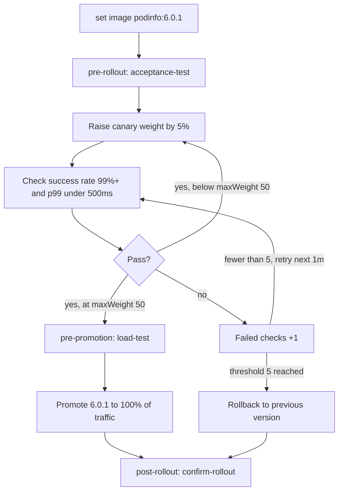

## Introduction

In the ever-evolving landscape of software development, continuous delivery and rapid iteration are paramount. However, releasing new versions of applications directly to production can be risky. A sudden surge in errors or performance degradation can impact users and potentially lead to significant downtime. Canary deployments offer a safer alternative by gradually rolling out changes to a small subset of users before fully releasing them to the entire user base. This approach allows for real-world testing and monitoring, enabling teams to detect and address issues early on, minimizing the potential impact on the overall system.

This blog post explores canary deployments using Flagger, a progressive delivery tool for Kubernetes. We'll delve into the core concepts of canary deployments, the benefits of using Flagger, and a practical guide to implementing canary deployments in your Kubernetes cluster. By the end of this post, you'll have a solid understanding of how to leverage Flagger to automate the canary release process and significantly reduce the risk associated with deploying new application versions.

## Core Concepts

Before diving into Flagger, let's solidify our understanding of the fundamental concepts surrounding canary deployments:

*   **Canary Release:** A deployment strategy where a new version of an application (the "canary") is initially rolled out to a small percentage of users. This "canary" version runs alongside the existing production version.
*   **Traffic Splitting:** Directing a portion of incoming traffic to the canary version and the remaining traffic to the existing stable version. This splitting is typically based on percentage, but more advanced strategies can leverage headers, cookies, or other request attributes for targeting specific user groups.
*   **Metrics-Driven Analysis:** Monitoring key performance indicators (KPIs) such as error rates, latency, and resource utilization for both the canary and stable versions. This analysis helps determine the health and stability of the canary release.
*   **Automated Rollback:** If the canary version exhibits unacceptable behavior (e.g., exceeds predefined error rate thresholds), the deployment automatically rolls back to the stable version, preventing further impact on users.
*   **Progressive Promotion:** If the canary version performs well, the traffic gradually increases to the canary until it receives 100% of the traffic. Once the canary is fully promoted, it becomes the new stable version.

## Why Use Flagger?

Flagger automates the canary release process, significantly reducing the manual effort and risk involved. Here's why you should consider using Flagger for your Kubernetes deployments:

*   **Automated Canary Analysis:** Flagger continuously monitors your application's metrics and automatically determines whether to promote or rollback the canary release based on predefined criteria.
*   **Integration with Metrics Providers:** Flagger seamlessly integrates with popular metrics providers such as Prometheus, Datadog, and New Relic, allowing you to leverage your [existing monitoring infrastructure](/posts/monitoring-k8s-with-prometheus-and-grafana/).
*   **Progressive Traffic Shifting:** Flagger progressively shifts traffic to the canary version based on the analysis results, ensuring a gradual and controlled rollout.
*   **Automated Rollbacks:** Flagger automatically rolls back the deployment to the previous stable version if the canary version fails, preventing further issues.
*   **Kubernetes Native:** Flagger is designed specifically for Kubernetes and integrates seamlessly with your existing Kubernetes workflows. It leverages [Custom Resource Definitions (CRDs)](/posts/kubernetes-operators-101-writing-your-own/) to define canary deployments, making it easy to manage and configure.
*   **Multiple Deployment Strategies:** Flagger supports various deployment strategies beyond canary, including A/B testing and [blue/green deployments](/posts/blue-green-deployments-on-kubernetes/), providing flexibility for different use cases.

## Implementation: Canary Deployment with Flagger

Let's walk through a practical example of implementing a canary deployment using Flagger. This example assumes you have a Kubernetes cluster set up and have `kubectl` configured to interact with your cluster. You will also need Helm installed.

**1. Install Flagger:**

First, add the Flagger Helm repository:

```bash
helm repo add flagger https://flagger.app
helm repo update
```

Next, install Flagger into the `flagger-system` namespace:

```bash
kubectl create namespace flagger-system
helm install flagger flagger/flagger -n flagger-system
```

**2. Deploy a Sample Application:**

For this example, we'll deploy a simple "podinfo" application.  Create a namespace called `test`:

```bash
kubectl create namespace test
```

Now, create a deployment and service for the podinfo application within the `test` namespace.  You can use a YAML file (e.g., `podinfo.yaml`) with the following content:

```yaml
apiVersion: apps/v1
kind: Deployment
metadata:
  name: podinfo
  namespace: test
spec:
  selector:
    matchLabels:
      app: podinfo
  replicas: 2
  template:
    metadata:
      labels:
        app: podinfo
    spec:
      containers:
      - name: podinfo
        image: ghcr.io/stefanprodan/podinfo:6.0.0
        ports:
        - containerPort: 9898
          name: http
        readinessProbe:
          httpGet:
            path: /readyz
            port: http
        livenessProbe:
          httpGet:
            path: /healthz
            port: http
        env:
        - name: PODINFO_UI_COLOR
          value: "#34577c" # Blue

---
apiVersion: v1
kind: Service
metadata:
  name: podinfo
  namespace: test
spec:
  selector:
    app: podinfo
  ports:
    - port: 80
      targetPort: 9898
      name: http
  type: LoadBalancer
```

Apply this YAML file:

```bash
kubectl apply -f podinfo.yaml
```

**3. Define the Canary Resource:**

Now, we define the `Canary` resource that tells Flagger how to manage the canary deployment. Create a file named `podinfo-canary.yaml` with the following content:


```yaml
apiVersion: flagger.app/v1beta1
kind: Canary
metadata:
  name: podinfo
  namespace: test
spec:
  targetRef:
    apiVersion: apps/v1
    kind: Deployment
    name: podinfo
  service:
    port: 80
    targetPort: 9898
  analysis:
    interval: 1m
    threshold: 5
    maxWeight: 50
    stepWeight: 5
    metrics:
      - name: request-success-rate
        interval: 1m
        thresholdRange:
          min: 99
        provider:
          type: prometheus
          address: http://prometheus.flagger-system:9090
          secretRef:
            name: ""
        query: |
          sum(rate(http_requests_total{job="podinfo",status!~"5.."}[{{interval}}]))
          /
          sum(rate(http_requests_total{job="podinfo"}[{{interval}}]))
          * 100
      - name: http-request-duration
        interval: 1m
        thresholdRange:
          max: 500
        provider:
          type: prometheus
          address: http://prometheus.flagger-system:9090
          secretRef:
            name: ""
        query: |
          histogram_quantile(0.99, sum(rate(http_request_duration_seconds_bucket{job="podinfo"}[{{interval}}])) by (le)) * 1000
    webhooks:
      - name: acceptance-test
        type: pre-rollout
        url: http://flagger-loadtester.flagger-system/
        timeout: 5s
        metadata:
          type: bash
          cmd: "curl -s http://podinfo.test:9898/ && sleep 2" # Ensure podinfo is responsive
      - name: load-test
        type: pre-promotion
        url: http://flagger-loadtester.flagger-system/
        timeout: 5s
        metadata:
          cmd: "hey -z 1m -q 10 -c 2 http://podinfo.test:8080/"
      - name: confirm-rollout
        type: post-rollout
        url: http://flagger-loadtester.flagger-system/
        timeout: 5s
        metadata:
          cmd: "echo 'confirm rollout'"
```


Let's break down the `Canary` resource:

*   `targetRef`: Specifies the Deployment to be managed by Flagger (in this case, the `podinfo` deployment).
*   `service`: Defines the service associated with the deployment, including the port and target port.
*   `analysis`: Configures the canary analysis parameters:
    *   `interval`: The frequency at which Flagger performs the analysis.
    *   `threshold`: The number of failed analysis iterations before Flagger rolls back the deployment.
    *   `maxWeight`: The maximum percentage of traffic that can be routed to the canary version.
    *   `stepWeight`: The increment by which the traffic weight is increased during each analysis iteration.
    *   `metrics`: Defines the metrics to be monitored during the analysis. In this example, we're monitoring `request-success-rate` (success rate of HTTP requests) and `http-request-duration` (99th percentile latency).  Note that the Prometheus server should be reachable on `http://prometheus.flagger-system:9090`. You might need to adjust this based on your Prometheus setup.
    *   `webhooks`: Defines webhooks for pre-rollout (acceptance tests), pre-promotion (load testing), and post-rollout (confirmation) actions.  The example relies on `flagger-loadtester`, which is another tool you can install, or you can adapt to use existing tools for testing.  These are optional but valuable for more complete automation.

Apply the `Canary` resource:

```bash
kubectl apply -f podinfo-canary.yaml
```

**4. Monitor the Canary Deployment:**

You can monitor the progress of the canary deployment using the `kubectl get canary` command:

```bash
kubectl -n test get canary podinfo -w
```

This command will display the current status of the canary deployment, including the traffic weight assigned to the canary version, the results of the analysis, and any events that occur during the deployment process.

You can also view Flagger's logs using:

```bash
kubectl -n flagger-system logs -f deployment/flagger
```

**5. Trigger a Canary Release:**

To trigger a canary release, update the `podinfo` deployment. For example, you can change the image version:

```bash
kubectl -n test set image deployment/podinfo podinfo=ghcr.io/stefanprodan/podinfo:6.0.1
```

Flagger will detect the changes in the deployment and automatically start the canary analysis process. It will gradually increase traffic to the new version, monitoring the metrics and webhooks.  If the metrics fall outside the defined thresholds or the webhooks fail, Flagger will automatically rollback to the previous version.  If the metrics are within the thresholds and webhooks pass, Flagger will gradually promote the new version until it receives 100% of the traffic.

This is the analysis loop Flagger runs every `1m` for the `podinfo` Canary, using the weights, thresholds and webhooks configured above.



**6. Verification**

Ensure that your prometheus instance is actually scraping metrics from the `podinfo` application. You may need to configure ServiceMonitors, or other prometheus configurations, to ensure metrics are being correctly gathered from the `podinfo` application.

## Conclusion

Canary deployments, powered by tools like Flagger, are essential for modern software delivery. They provide a controlled and automated way to release new versions of applications, minimizing the risk of impacting users. By monitoring key metrics, performing automated analysis, and implementing progressive traffic shifting, Flagger enables teams to iterate quickly and confidently, delivering high-quality software with reduced downtime. Implementing Flagger might require a slight learning curve and some initial configuration, but the benefits of automated canary deployments significantly outweigh the initial investment in the long run. Remember to adapt the examples provided to your specific application, metrics provider, and testing requirements for optimal results.
