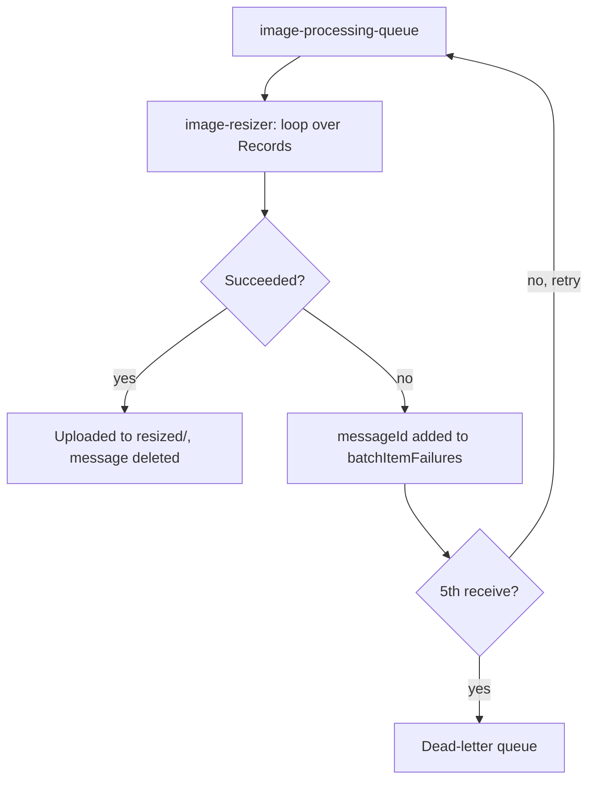

## Introduction

In modern application architectures, decoupling components is crucial for scalability, resilience, and maintainability. AWS Lambda and SQS (Simple Queue Service) provide a powerful combination for building serverless, event-driven systems.  Lambda functions can process messages from SQS queues, allowing you to asynchronously handle workloads without managing servers. This post will guide you through a practical implementation of this pattern, covering the core concepts, implementation steps, common pitfalls, and real-world applications. We'll build a simple image processing pipeline where image uploads trigger a Lambda function to resize the image and store it.

## Core Concepts

Before diving into the implementation, let's define the key components:

*   **AWS Lambda:** A serverless compute service that lets you run code without provisioning or managing servers. You pay only for the compute time you consume.
*   **AWS SQS (Simple Queue Service):** A fully managed message queuing service that enables you to decouple and scale microservices, distributed systems, and serverless applications. SQS offers two queue types:
    *   **Standard Queues:** Provide best-effort ordering (messages might arrive in a different order than they were sent) and at-least-once delivery (messages might be delivered more than once).
    *   **FIFO (First-In-First-Out) Queues:** Guarantee exactly-once processing and preserve the order in which messages are sent and received.
*   **Event-Driven Architecture:** A software architecture paradigm where the behavior of different application components is triggered by events. SQS plays a crucial role here, acting as the "event bus" that connects different components.
*   **Serverless:** A cloud computing execution model where the cloud provider dynamically manages the allocation of machine resources.

In this example, the workflow is:

1.  An event occurs (e.g., a file is uploaded to S3).
2.  A message describing the event is sent to an SQS queue.
3.  A Lambda function is triggered by the message in the queue.
4.  The Lambda function processes the event (e.g., resizes the image).

## Practical Implementation

Here's a step-by-step guide to building a serverless image processing pipeline using AWS Lambda and SQS:

**1. Create an SQS Queue:**

*   Log into the AWS Management Console.
*   Navigate to the SQS service.
*   Click "Create queue."
*   Choose "Standard" or "FIFO" queue type. For simple image processing, a standard queue is sufficient. [If you require strict ordering](/posts/leveraging-aws-sqs-message-groups-for-ordered-processing/), choose FIFO.
*   Name your queue (e.g., `image-processing-queue`).
*   Set a dead-letter queue (a redrive policy with a `maxReceiveCount`, for example 5) so a message that keeps failing is set aside instead of retried forever.
*   Configure queue settings as needed (e.g., visibility timeout, message retention period). The *Visibility Timeout* is the amount of time a message stays invisible to other consumers after it's retrieved from the queue.
*   Create the queue.

**2. Create an IAM Role for the Lambda Function:**

*   Navigate to the IAM service.
*   Click "Roles" and then "Create role."
*   Select "AWS service" and choose "Lambda" as the service that will use this role.
*   Grant only what the function needs:
    *   `AWSLambdaSQSQueueExecutionRole` (AWS managed): lets Lambda receive and delete messages from the queue and write logs to CloudWatch.
    *   An inline policy allowing `s3:GetObject` and `s3:PutObject` on your bucket only (`arn:aws:s3:::your-s3-bucket-name/*`). Avoid `AmazonS3FullAccess` and `AmazonSQSFullAccess`: they grant access to every bucket and queue in the account.
*   Name the role (e.g., `lambda-image-processing-role`).
*   Create the role.

**3. Create the Lambda Function:**

*   Navigate to the Lambda service.
*   Click "Create function."
*   Choose "Author from scratch."
*   Name your function (e.g., `image-resizer`).
*   Select a runtime (e.g., "Python 3.12").
*   Under "Change default execution role," choose "Use an existing role" and select the IAM role you created in the previous step.
*   Create the function.

**4. Implement the Lambda Function Code:**

Here's a Python example using the `Pillow` library to resize images. Pillow contains compiled code, so it has to be built for Lambda's Linux environment rather than your laptop: `pip install --platform manylinux2014_x86_64 --only-binary=:all: --target package pillow` (use `manylinux2014_aarch64` for arm64 functions), or ship it as a Lambda layer.

```python
import json
import os
import uuid

import boto3
from PIL import Image

s3 = boto3.client("s3")
THUMBNAIL_SIZE = (128, 128)


def resize_image(image_path, resized_path, size):
    """Resize an image and save it to a new location."""
    with Image.open(image_path) as image:
        image.resize(size, Image.LANCZOS).save(resized_path)


def process(message_body):
    """Download, resize and upload one image. Raises on any failure."""
    message = json.loads(message_body)
    bucket, key = message["bucket"], message["key"]
    # Object keys can contain "/", so never use the key as a local file name.
    suffix = os.path.splitext(key)[1]
    download_path = f"/tmp/{uuid.uuid4()}{suffix}"
    resized_path = f"/tmp/{uuid.uuid4()}{suffix}"
    try:
        s3.download_file(bucket, key, download_path)
        resize_image(download_path, resized_path, THUMBNAIL_SIZE)
        s3.upload_file(resized_path, bucket, f"resized/{key}")
    finally:
        for path in (download_path, resized_path):
            if os.path.exists(path):
                os.remove(path)


def lambda_handler(event, context):
    """Process a batch of SQS messages and report only the failures."""
    failures = []
    for record in event["Records"]:
        try:
            process(record["body"])
        except Exception as exc:
            print(f"Failed to process message {record['messageId']}: {exc}")
            failures.append({"itemIdentifier": record["messageId"]})
    # Messages listed here return to the queue for another attempt; after
    # maxReceiveCount attempts, SQS moves them to the dead-letter queue.
    return {"batchItemFailures": failures}
```

Why `batchItemFailures` matters: if the handler caught an error and returned normally, Lambda would treat the whole batch as processed and delete every message, so the failed ones would be lost silently. Returning the failed message IDs (with "Report batch item failures" enabled on the trigger, step 5) retries just those messages.

The flow below traces one message through the handler, including partial batch retries and the dead-letter queue.




*   Upload this code to your Lambda function.  You will need to zip it first along with any libraries used (Pillow in this example). You can use a Lambda Layer to easily package dependencies.
*  Configure the Lambda timeout to be large enough to handle processing the images. Go to Configuration > General > Edit. Increase the Timeout value.

**5. Configure the Lambda Trigger:**

*   In the Lambda function configuration, click "Add trigger."
*   Select "SQS" as the trigger.
*   Choose the SQS queue you created.
*   Configure batch size (the number of messages the Lambda function will process at once).
*   Turn on **Report batch item failures**, so the `batchItemFailures` response retries only the failed messages.
*   Enable the trigger.

**6. Test the Setup:**

*   Send a message to the SQS queue. The message should be a JSON string containing the bucket name and key of the image you want to resize. For example:

    ```json
    {
      "bucket": "your-s3-bucket-name",
      "key": "image.jpg"
    }
    ```

*   The Lambda function should be triggered, download the image from S3, resize it, and upload the resized image to your S3 bucket (in the `/resized` folder).
*   Check the Lambda function's CloudWatch logs for any errors.

## Common Mistakes

*   **Incorrect IAM Permissions:** The Lambda function needs sufficient permissions to access SQS, read from S3 (if applicable), and write to S3 (if applicable). Ensure the IAM role has the necessary policies attached.
*   **Missing Dependencies:** If your Lambda function uses external libraries (like Pillow), you need to include them in the deployment package or use Lambda Layers.
*   **Insufficient Timeout:** If the Lambda function takes longer than the configured timeout, it will be terminated. Increase the timeout if necessary.
*   **Error Handling:** Implement robust error handling in your Lambda function. Catch exceptions, log errors, and potentially retry failed operations. Consider dead-letter queues for failed messages.
*   **Message Format Issues:** The Lambda function expects a specific message format. Ensure the messages sent to the SQS queue adhere to this format.
*   **Visibility Timeout Too Short:** If the visibility timeout is shorter than the time it takes the Lambda function to process a message, the message might be processed multiple times. AWS recommends a visibility timeout of at least six times the function timeout.
*   **Ignoring Idempotency:** Standard queues deliver at least once, and failed messages are retried, so the same message can be processed more than once. Make processing safe to repeat. Re-uploading the same thumbnail is harmless; for side effects such as sending an email or charging a card, record the message ID or rely on a unique constraint so a duplicate becomes a no-op (see [Idempotent Operations in Distributed Systems](/posts/idempotent-operations-in-distributed-systems-a-practical-guide/)).

## Interview Perspective

Interviewers often ask about using Lambda and SQS to evaluate your understanding of serverless architectures, event-driven patterns, and asynchronous processing.

*   **Key Talking Points:**
    *   Explain the benefits of using Lambda and SQS for decoupling and scalability.
    *   Describe how Lambda functions can be triggered by SQS messages.
    *   Discuss the different SQS queue types (Standard and FIFO) and their trade-offs.
    *   Explain how to configure IAM roles and permissions for Lambda functions.
    *   Explain how you make consumers idempotent (message IDs, conditional writes or unique constraints) and how partial batch failures and dead-letter queues handle poison messages.
    *   Describe how to handle errors and retries in Lambda functions.
    *   Discuss the importance of visibility timeout in SQS.
    *   Explain the concept of dead-letter queues.
    *   Be prepared to discuss trade-offs compared to other architectures, like using API Gateway directly to trigger the lambda functions.
*   **Typical Questions:**
    *   "How would you design a system to process large numbers of images uploaded to S3?"
    *   "What are the advantages of using SQS in conjunction with Lambda?"
    *   "How do you handle errors in a Lambda function triggered by SQS?"
    *   "What is the difference between Standard and FIFO queues in SQS?"
    *   "How do you ensure that a message is processed exactly once in a serverless architecture?"

## Real-World Use Cases

The Lambda and SQS combination is applicable in various scenarios:

*   **Image/Video Processing:** As demonstrated in the example, resizing images, transcoding videos, or applying other transformations.
*   **Order Processing:** Decoupling order placement from fulfillment processes. When an order is placed, a message is sent to an SQS queue, triggering a Lambda function to handle order processing, payment verification, and inventory management.
*   **Log Aggregation:** Collecting logs from various sources and sending them to a central logging system (e.g., Elasticsearch) for analysis.
*   **Data Transformation:** Processing data from various sources, transforming it, and loading it into a data warehouse.
*   **Email/SMS Sending:** Sending emails or SMS messages asynchronously.

## Conclusion

Using AWS Lambda and SQS together provides a powerful and flexible way to build serverless, event-driven applications. By decoupling components and leveraging asynchronous processing, you can create scalable, resilient, and cost-effective systems. This guide provided a practical example of an image processing pipeline, but the principles can be applied to a wide range of use cases. Remember to pay attention to IAM permissions, error handling, and message formats to ensure a robust and reliable implementation.
