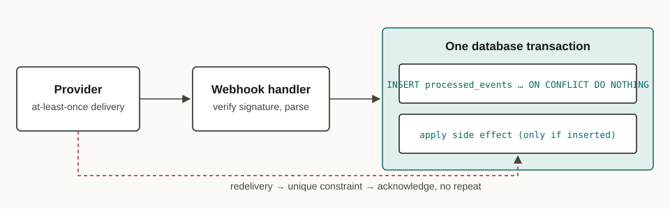

---
# Sample article that exercises every part of the content contract
# (docs/content-authoring.md). It stays a draft: `jekyll serve --drafts`
# renders it; production builds leave it out.
title: "Idempotent Webhook Handlers: Surviving At-Least-Once Delivery"
description: >-
  Webhook providers retry, and some deliver the same event twice. A
  practical pattern for processing each event exactly once with a
  deduplication table and a single database transaction.
date: 2026-09-28 10:00:00 +0000
author: ritesh
categories: [Distributed Systems, Reliability]
tags: [idempotency, webhooks, postgresql, python, reliability]
kind: Guide
draft: true
cover:
  image: cover.webp
  alt: Two deliveries of the same webhook event; the second is acknowledged as already processed.
---

Webhook providers promise **at-least-once** delivery, not exactly-once. Stripe states plainly that an endpoint "might occasionally receive the same event more than once", and every provider retries when your endpoint times out or returns an error. If your handler charges a card, sends an email or ships an order, a duplicate delivery repeats that side effect.

This guide builds a handler that applies each event's side effect once, no matter how many times the event arrives. It is the webhook-specific version of the general pattern in [Idempotent Operations in Distributed Systems](/posts/idempotent-operations-in-distributed-systems-a-practical-guide/).

## Why duplicates happen

Duplicates are not a provider bug; they are the price of reliable delivery. The common causes:

| Cause | What the provider sees | What you see |
| :--- | :--- | :--- |
| Handler is slow | Timeout, so it retries | Two deliveries, the first may still be running |
| Handler crashes after the side effect | 5xx or connection reset | Side effect done, event delivered again |
| Network drops your `200 OK` | No acknowledgement | Event delivered again |
| Provider-side replay | Manual or automated resend | Same event ID, days later |

> [!NOTE]
> GitHub expects a 2XX response within 10 seconds and identifies each delivery with the `X-GitHub-Delivery` header. Most providers include a stable event ID in the payload; use that, not a hash of the body, as the deduplication key.

## The pattern: record, then act, in one transaction

The handler inserts the event ID into a table with a unique constraint and applies the side effect **in the same database transaction**. A redelivered event hits the constraint, so the side effect is skipped and the handler still acknowledges the delivery.



### The deduplication table

```sql
CREATE TABLE processed_events (
    event_id     text        PRIMARY KEY,
    provider     text        NOT NULL,
    processed_at timestamptz NOT NULL DEFAULT now()
);
```

`INSERT ... ON CONFLICT DO NOTHING RETURNING` tells you in one round trip whether this delivery is the first one: a returned row means you won the insert.

### The handler

```python
import psycopg

def handle_payment_succeeded(conn: psycopg.Connection, event: dict) -> None:
    """Apply a payment event exactly once, however often it is delivered."""
    with conn.transaction():
        first_delivery = conn.execute(
            """
            INSERT INTO processed_events (event_id, provider)
            VALUES (%s, 'stripe')
            ON CONFLICT (event_id) DO NOTHING
            RETURNING event_id
            """,
            (event["id"],),
        ).fetchone()

        if first_delivery is None:
            return  # duplicate: already applied, acknowledge and move on

        order_id = event["data"]["object"]["metadata"]["order_id"]
        conn.execute(
            "UPDATE orders SET status = 'paid' WHERE id = %s AND status <> 'paid'",
            (order_id,),
        )
```

Because both statements commit or roll back together, a crash between them cannot leave a recorded-but-unapplied event, or an applied-but-unrecorded one.

> [!WARNING]
> Do not record the event in one transaction and apply the side effect in another. A crash between the two either loses the side effect permanently or reintroduces the duplicate you were trying to prevent.

## Side effects outside the database

Emails, third-party API calls and queue publishes cannot join a database transaction. Two options keep them safe:

1. **Pass the event ID downstream as an idempotency key.** Many APIs accept one (the IETF [Idempotency-Key header draft](https://datatracker.ietf.org/doc/draft-ietf-httpapi-idempotency-key-header/) standardizes the idea), so a retried call is deduplicated by the receiver.
2. **Use an outbox.** Write the intended message to an `outbox` table inside the same transaction, and let a separate worker deliver it with retries. The worker must itself be idempotent, which is the problem covered in [Fixing Idempotency Gaps in AI-Generated Kafka Consumers](/posts/fixing-idempotency-gaps-in-ai-generated-kafka-consumers-on-kubernetes/).

> [!TIP]
> Acknowledge fast, process later. Verify the signature, persist the raw event, return `200`, and do the real work in a worker. Timeouts, which cause most duplicates, then disappear.

## Verifying it

Replay the same event twice and check that the side effect happened once:

```bash
# Deliver the same fixture twice, then count the effects.
curl -s -X POST localhost:8000/webhooks/stripe -H 'Content-Type: application/json' -d @fixtures/payment_succeeded.json
curl -s -X POST localhost:8000/webhooks/stripe -H 'Content-Type: application/json' -d @fixtures/payment_succeeded.json
psql "$DATABASE_URL" -c "SELECT count(*) FROM processed_events WHERE event_id = 'evt_test_1';"
```

> [!RESULT]
> One row in `processed_events`, one status change on the order, and two `200 OK` responses: the provider is satisfied and the side effect ran once.

## Retention

The table grows forever unless you prune it. Keep IDs at least as long as the provider can redeliver or replay an event, then delete older rows in a scheduled job.

## References

- [Stripe: handle duplicate events](https://docs.stripe.com/webhooks#handle-duplicate-events)
- [GitHub: best practices for using webhooks](https://docs.github.com/en/webhooks/using-webhooks/best-practices-for-using-webhooks)
- [PostgreSQL: INSERT … ON CONFLICT](https://www.postgresql.org/docs/current/sql-insert.html)
- [IETF draft: The Idempotency-Key HTTP Header Field](https://datatracker.ietf.org/doc/draft-ietf-httpapi-idempotency-key-header/)
