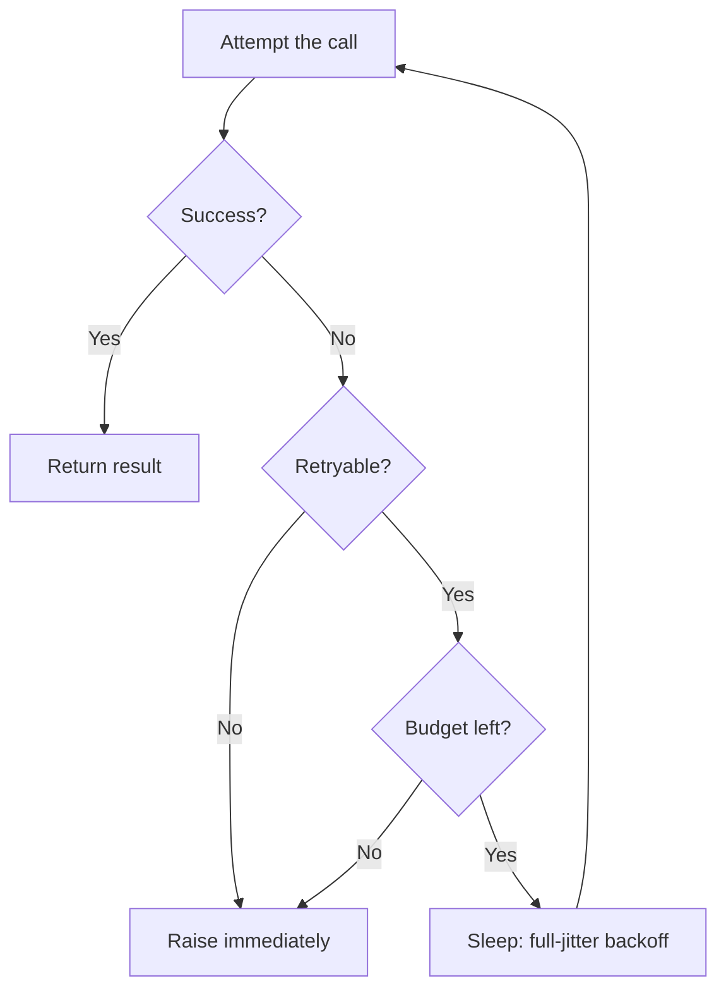

Every remote call can fail for a little while: a network blip, a brief overload, a deploy rolling through the fleet. Trying the same request again often succeeds, which makes retries the first tool most engineers reach for. But retries are, in the AWS Builders' Library's word, "selfish": each retry spends more of the server's time to buy the client a higher chance of success. When failures are rare and transient, that trade is worth it. When the server is already struggling, retries can turn a rough patch into a full outage.

This guide covers the disciplined version: which failures are worth retrying, why the wait between attempts should grow exponentially, and why a little randomness — jitter — is what keeps retries from stampeding.

## When a retry is safe

Retry failures that may succeed later: connection errors, timeouts, `503 Service Unavailable`, `429 Too Many Requests`. Do not retry failures that will not change: `400 Bad Request` will fail the same way the second time. (One caveat from AWS: eventual consistency blurs this line — a client error one moment can become a success the next as state propagates — so treat the distinction as a heuristic, not a law.)

The harder question is side effects. A timeout does not mean the request had no effect: the server may have applied it and lost the response on the way back. Retrying a non-idempotent write can apply it twice — charging a card twice, creating two orders.

> [!IMPORTANT]
> Only retry operations that are safe to repeat. Read-only calls usually are; writes need idempotency designed in, such as idempotency keys or conditional writes. The patterns for that are covered in [Idempotent Operations in Distributed Systems](/posts/idempotent-operations-in-distributed-systems-a-practical-guide/).

## Why naive retries make things worse

Retrying immediately, or on a fixed interval, synchronizes clients. When a service stumbles, every client fails at roughly the same moment, waits the same fixed delay, and retries at the same instant — a thundering herd that hits the recovering service harder than the original traffic did.

Layered retries multiply. The Builders' Library walks through a five-deep call stack where each layer retries three times: when the database at the bottom starts failing under load, the retries compound to **243x** the original load, making recovery nearly impossible. Their best practice is to retry at a single layer of the stack, not every one.

Even exponential backoff alone does not fully fix the clustering. In the AWS Architecture Blog's simulations, adding backoff "helps a small amount, but doesn't solve the problem": calls happen less frequently, yet visible clusters of simultaneous retries remain.

## Capped exponential backoff

Instead of waiting a fixed time, grow the wait exponentially: `base * 2^attempt` — 100ms, 200ms, 400ms, and so on. The growth quickly becomes absurd, so cap it: never sleep longer than a maximum, the *capped* exponential backoff. And cap the attempts too: give up after a handful of tries and let the failure surface to a layer that can do something smarter with it.

Pair every retry loop with a timeout on the call itself. Timeouts stop a client from holding threads, connections and memory while waiting on a call that may never return; AWS's guidance is to pick the timeout from the downstream's latency percentiles — for example, accept a 0.1% false-timeout rate and set the timeout at the service's p99.9 latency.

## Adding jitter

The remaining problem is correlation: if every client backs off exponentially from the same failure instant, they still retry in lockstep. The fix is jitter — randomizing each sleep so retries spread out in time. The Architecture Blog compares three variants, where `cap` is the maximum sleep and `attempt` counts from zero:

- **Full jitter:** `sleep = random_between(0, min(cap, base * 2^attempt))`
- **Equal jitter:** `sleep = temp/2 + random_between(0, temp/2)`, keeping at least half the backoff so sleeps never collapse to near zero
- **Decorrelated jitter:** `sleep = min(cap, random_between(base, previous_sleep * 3))`, which derives each sleep from the last random one

In their simulations, plain exponential backoff without jitter is the clear loser — more work *and* more time. Of the jittered variants, full jitter does the least work; equal jitter does slightly more work and takes much longer. Full jitter is the sensible default.

> [!TIP]
> Jitter is not only for retries. The Builders' Library recommends adding it to every timer, cron job and periodic task: clients that fire "once a minute" tend to line up on the minute boundary and create sharp load spikes. One subtlety: for scheduled work, use a deterministic per-host jitter rather than a fresh random value each time, so a spike reproduces the same way twice and stays debuggable.

## Putting it together

The whole policy as a flow:



And as code — a small helper implementing full jitter, with the retry decision and the budget as parameters:

```python
import random
import time
from collections.abc import Callable
from typing import TypeVar

T = TypeVar("T")

def with_retry(
    fn: Callable[[], T],
    *,
    max_attempts: int = 5,
    base_delay: float = 0.1,
    max_delay: float = 30.0,
    retryable: Callable[[BaseException], bool] = lambda e: True,
) -> T:
    """Run fn, retrying failures with full-jitter backoff.

    The sleep before retry n is random_between(0, min(max_delay, base_delay * 2**n)).
    Raises the last error when the failure is not retryable or the budget is spent.
    """
    for attempt in range(max_attempts):
        try:
            return fn()
        except Exception as exc:
            if not retryable(exc) or attempt == max_attempts - 1:
                raise
            cap = min(max_delay, base_delay * 2 ** attempt)
            time.sleep(random.uniform(0, cap))
    raise AssertionError("unreachable")
```

Used against an HTTP endpoint, retrying only server-side failures:

```python
import urllib.error
import urllib.request

def fetch_status() -> int:
    with urllib.request.urlopen("https://example.com/health", timeout=5) as resp:
        return resp.status

status = with_retry(
    fetch_status,
    max_attempts=4,
    retryable=lambda e: not isinstance(e, urllib.error.HTTPError) or e.code >= 500,
)
```

Connection errors and timeouts are not `HTTPError`s, so they are retried; a `404` raises immediately.

## When retries are not enough

Retries have a budget, and every policy above is a way of spending it: attempts, total delay, a deadline. When the budget is gone, the client must stop asking — and ideally stop asking *before* the server has to say no. Two mechanisms from production practice:

- **Client-side throttling.** Google's SRE book describes adaptive throttling: when a client sees a significant share of its recent requests rejected, it caps its own outgoing traffic and fails the excess locally, without touching the network. The decision uses only local history, so it adds no dependencies and no latency.
- **Circuit breaking.** When a downstream is clearly down, stop calling it for a while instead of retrying into the void. See [Boosting Microservice Resilience: Implementing Circuit Breaker Pattern with Resilience4j](/posts/boosting-microservice-resilience-implementing-circuit-breaker-pattern-with-resilience4j/).

Retries also compose with at-least-once delivery: a relay that retries publishing, like the one in [Transactional Outbox: Reliable Events Without Dual Writes](/posts/transactional-outbox-reliable-events-without-dual-writes/), depends on consumers tolerating duplicates — which is exactly why the idempotency rule from the first section matters.

## References

- [Timeouts, retries, and backoff with jitter](https://aws.amazon.com/builders-library/timeouts-retries-and-backoff-with-jitter/), AWS Builders' Library
- [Exponential Backoff And Jitter](https://aws.amazon.com/blogs/architecture/exponential-backoff-and-jitter/), AWS Architecture Blog
- [Handling Overload](https://sre.google/sre-book/handling-overload/), Google Site Reliability Engineering book
