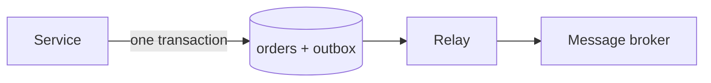

Your service takes an order: it inserts a row into the `orders` table and publishes an `OrderPlaced` event so the warehouse, billing and notification services can react. Two writes, two systems — and no transaction that spans both. If the database commit succeeds but the publish fails, downstream services never hear about the order. If the publish succeeds but the commit rolls back, they react to an order that does not exist.

This is the dual-write problem, and no retry timing fixes it. The transactional outbox pattern solves it structurally: write the event into an `outbox` table in the same database transaction as the business data, then let a separate relay deliver it to the broker. The database transaction becomes the single source of truth, and publishing becomes a repeatable background job.

## The dual-write problem

A relational database and a message broker cannot join the same transaction in any practical setup. Two-phase commit across heterogeneous systems is slow, fragile and rarely supported by managed brokers, so every real system performs the two writes separately — and separately means one can fail while the other succeeds.

The failure modes are mirror images:

| Order of writes | Failure | Result |
| :--- | :--- | :--- |
| Commit, then publish | Crash or network error between the two | Event lost; downstream never reacts |
| Publish, then commit | Rollback after a successful publish | Ghost event; downstream reacts to nothing |

> [!WARNING]
> "Publish first, then commit" does not merely risk duplicates — it creates events for state that never existed. Downstream services cannot distinguish a ghost event from a real one.

Retrying the failed half narrows the window but never closes it: a crash can always land between the two writes. The fix is to stop doing two writes and do one, then deliver the second as a consequence of the first.

## The pattern: one transaction, then a relay

The outbox pattern splits publishing into two steps with different guarantees:

1. **Atomic write.** The service inserts the business row and the event row into an `outbox` table in the same database transaction. Both commit or neither does — the database already guarantees this.
2. **Reliable relay.** A separate relay process reads unpublished rows from the outbox table and publishes them to the broker, marking each row sent. If the relay crashes, it restarts and continues; unpublished rows simply wait.



Because the event row is written in the same transaction as the order, an event exists exactly when the order exists. Ghost events become impossible; lost events become a relay-availability problem, which retries solve.

## The outbox table

```sql
CREATE TABLE outbox (
    id           uuid PRIMARY KEY DEFAULT gen_random_uuid(),
    aggregate    text NOT NULL,
    event_type   text NOT NULL,
    payload      jsonb NOT NULL,
    created_at   timestamptz NOT NULL DEFAULT now(),
    published_at timestamptz
);

CREATE INDEX outbox_unpublished_idx
    ON outbox (created_at)
    WHERE published_at IS NULL;
```

The partial index keeps the relay's "what is unpublished?" query fast even as published history accumulates. The `aggregate` column names the entity the event belongs to (here, `order`); it doubles as a partitioning key later.

> [!NOTE]
> Keep the payload self-contained: include everything a consumer needs, not just an ID. Consumers that must query back into your database to understand an event inherit your availability.

## Writing to the outbox

The application code changes by one `INSERT`:

```python
import json
import psycopg

def place_order(conn: psycopg.Connection, order: dict) -> None:
    """Persist the order and stage its event in one transaction."""
    with conn.transaction():
        conn.execute(
            "INSERT INTO orders (id, customer_id, total) VALUES (%s, %s, %s)",
            (order["id"], order["customer_id"], order["total"]),
        )
        conn.execute(
            """
            INSERT INTO outbox (aggregate, event_type, payload)
            VALUES (%s, %s, %s)
            """,
            ("order", "OrderPlaced", json.dumps(order)),
        )
    # Both rows committed together, or neither did. Delivery happens later.
```

Nothing here can produce a ghost or lost event: if the transaction rolls back, the event row vanishes with the order.

## The relay: polling publisher

The simplest relay polls for unpublished rows, publishes them, and marks them sent:

```python
import json
from kafka import KafkaProducer

producer = KafkaProducer(value_serializer=lambda v: json.dumps(v).encode())

def relay_batch(conn) -> int:
    """Publish up to 100 unpublished events, oldest first."""
    with conn.transaction():
        rows = conn.execute(
            """
            SELECT id, event_type, payload FROM outbox
            WHERE published_at IS NULL
            ORDER BY created_at
            LIMIT 100
            FOR UPDATE SKIP LOCKED
            """
        ).fetchall()
        for event_id, event_type, payload in rows:
            producer.send(
                "orders.events",
                key=str(event_id).encode(),
                value={"type": event_type, "data": payload},
            )
        producer.flush()
        for event_id, _, _ in rows:
            conn.execute(
                "UPDATE outbox SET published_at = now() WHERE id = %s",
                (event_id,),
            )
    return len(rows)
```

> [!IMPORTANT]
> The relay delivers at-least-once, not exactly-once. A crash between `flush()` and the `UPDATE` redelivers those events on restart. Consumers must tolerate duplicates — the standard answer is idempotent handlers, as described in [Idempotent Operations in Distributed Systems](/posts/idempotent-operations-in-distributed-systems-a-practical-guide/).

> [!TIP]
> `FOR UPDATE SKIP LOCKED` lets several relay workers poll the same table without blocking each other: each worker skips rows another worker already locked.

Polling every few seconds is easy to operate and easy to reason about; its cost is a constant trickle of queries and a small delivery delay. When that delay matters, the alternative is log tailing.

## The relay: transaction log tailing

Instead of polling, a change-data-capture connector (Debezium is the usual choice) tails the database's write-ahead log and streams committed outbox rows to the broker with sub-second latency and no polling load. The trade-off is operational: you now run a connector runtime next to your database, and schema changes to the outbox table need the connector's attention.

> [!NOTE]
> Whichever relay you choose, the contract with the application is identical: commit the event row and it will be delivered. Teams can start with polling and graduate to log tailing without touching application code.

## Ordering and partitioning

Events for one aggregate usually need to arrive in order — nobody wants `OrderCancelled` processed before `OrderPlaced`. Key the broker record by aggregate ID so all events for one order land in the same partition, where the broker preserves their order. The relay already reads rows in `created_at` order; partitioning by aggregate keeps that order end to end. For the queue-flavored version of this idea, see [Leveraging AWS SQS Message Groups for Ordered Processing](/posts/leveraging-aws-sqs-message-groups-for-ordered-processing/).

Consumers reading from Kafka face the mirror-image problem on their side; closing idempotency gaps there is covered in [Fixing Idempotency Gaps in AI-Generated Kafka Consumers on Kubernetes](/posts/fixing-idempotency-gaps-in-ai-generated-kafka-consumers-on-kubernetes/).

## Operating the relay

A relay is a small piece of infrastructure with a short checklist:

- **Watch the lag.** Track the age of the oldest unpublished row; if it keeps growing, the relay is behind or stuck. Pick an alert threshold that matches your delivery expectations.
- **Handle poison rows.** A row the broker persistently rejects (an oversized payload, for example) will be retried forever. Quarantine it to a dead-letter table after a bounded number of attempts — the bound is yours to choose, but choose one.
- **Clean up.** The outbox table grows without bound unless published rows are archived or deleted past your replay window.

> [!NOTE]
> Deleting published rows is safe once no consumer can need a replay of them. If your consumers support replays — rebuilding a read model, for instance — archive instead of delete.

## References

- Chris Richardson, "Transactional outbox", *microservices.io* — https://microservices.io/patterns/communication-with-rollback/transactional-outbox.html
- Debezium documentation — https://debezium.io/documentation/reference/stable/
- Apache Kafka documentation — https://kafka.apache.org/documentation/
- PostgreSQL documentation, `LISTEN` / `NOTIFY` — https://www.postgresql.org/docs/current/sql-notify.html
