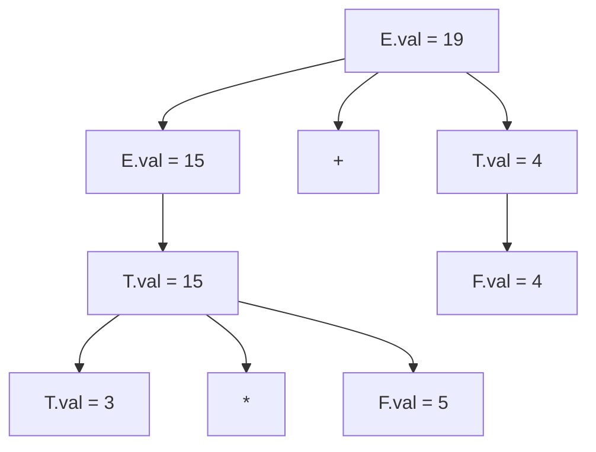

# Chapter 5: Syntax-Directed Translation (SDT)

> **Reference**: *Compilers* (Dragon Book), Chapter 5

Parsing only checks structure. SDT attaches *meaning* to the structure by associating **Attributes** with grammar symbols and **Semantic Rules** with productions.

## 5.1 Information Flow

### Synthesized Attributes
Value is computed from children.
*   **Rule**: `E -> E1 + T`
*   **Semantic Action**: `E.val = E1.val + T.val`
*   Information flows **Bottom-Up**.
*   Typical for evaluating expressions.

### Inherited Attributes
Value is computed from parent or siblings.
*   **Rule**: `D -> T L` (Declaration: `int a, b, c`)
*   **Semantic Action**: `L.in = T.type` (Pass 'int' down to the list L).
*   Information flows **Top-Down** or **Sideways**.
*   Typical for type checking and context handling.

---

## 5.2 S-Attributed Definitions
A grammar is **S-Attributed** if it uses *only* synthesized attributes.
*   **Evaluation**: Can be evaluated during a simple Post-Order Traversal of the parse tree.
*   **Implementation**: Can be implemented easily in an LR Parser (Yacc/Bison) because the stack naturally holds the values of children when reducing.

## 5.3 L-Attributed Definitions
A grammar is **L-Attributed** if for every production $A \to X_1 X_2 \dots X_n$, the inherited attributes of $X_j$ only depend on:
1.  Inherited attributes of $A$ (Parent).
2.  Attributes of symbols $X_1 \dots X_{j-1}$ (Left Siblings).
*   **Crucial Restriction**: Information flows Left-to-Right.
*   **Evaluation**: Can be evaluated in a single Left-to-Right pass (DFS). Compatible with LL Parsers.

---

## 5.4 Example: Simple Calculator (S-Attributed)

**Grammar & Rules**:
1.  `L -> E \n`    : `{ print(E.val); }`
2.  `E -> E1 + T`  : `{ E.val = E1.val + T.val; }`
3.  `E -> T`       : `{ E.val = T.val; }`
4.  `T -> T1 * F`  : `{ T.val = T1.val * F.val; }`
5.  `T -> F`       : `{ T.val = F.val; }`
6.  `F -> ( E )`   : `{ F.val = E.val; }`
7.  `F -> digit`   : `{ F.val = digit.lexval; }`

**Annotated Parse Tree** for `3 * 5 + 4`:

## 5.5 Applications
1.  **Type Checking**: Verify `L.type == R.type`.
2.  **Intermediate Code Generation**: Concatenate code strings from children.
3.  **AST Construction**: `E.node = new PlusNode(E1.node, T.node)`.
